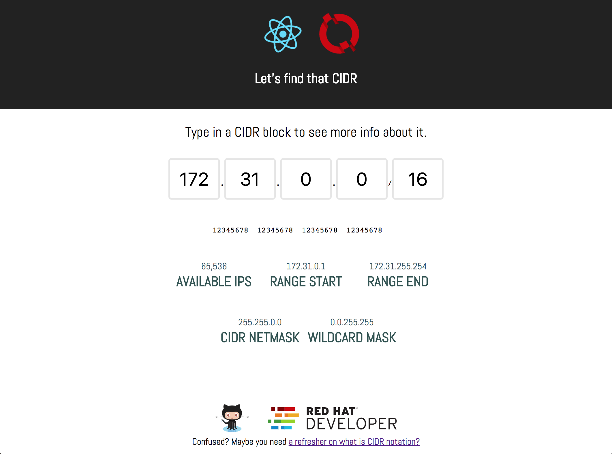

# CIDR Finder
This is a simple React demo app that let's you visualize information about CIDR addresses. It can come in handy when setting up networking in the cloud. This app can be used with OpenShift and leverage the developer automation capabilities and [Application Runtimes](https://developers.redhat.com/products/rhoar/overview/).

Here's what it looks like:

## How to run this?

### Run locally
Clone this repo (optionally fork it first)
> `git clone https://github.com/dudash/cidr-finder.git`

> `cd cidr-finder`

Install the dependencies
> `yarn install`

Run
> `yarn run start`

### Run in OpenShift

First off, you need access to an OpenShift cluster.  Don't have an OpenShift cluster?  That's OK, download the CDK for free here: [https://developers.redhat.com/products/cdk/overview/](1).

Then just use the oc CLI tool to create a new project, build/containerize/deploy the app, and expose it outside the cluster.
 > `oc new-project cidr-finder `

 > `oc new-app bucharestgold/centos7-s2i-nodejs:latest~https://github.com/dudash/cidr-finder.git`

 > `oc expose svc/cidr-finder`

## About the code
* [Here's the autogen react docs](./README-REACT.md)
* extra env vars for OpenShift are found in the `.s2i/environment` file

## Thanks to
Thanks to the authors of [this CIDR project][2] as it served as the original basis for this app.

## License
Under the terms of the MIT.

[1]: https://developers.redhat.com/products/cdk/overview/
[2]: https://github.com/yuvadm/cidr.xyz
